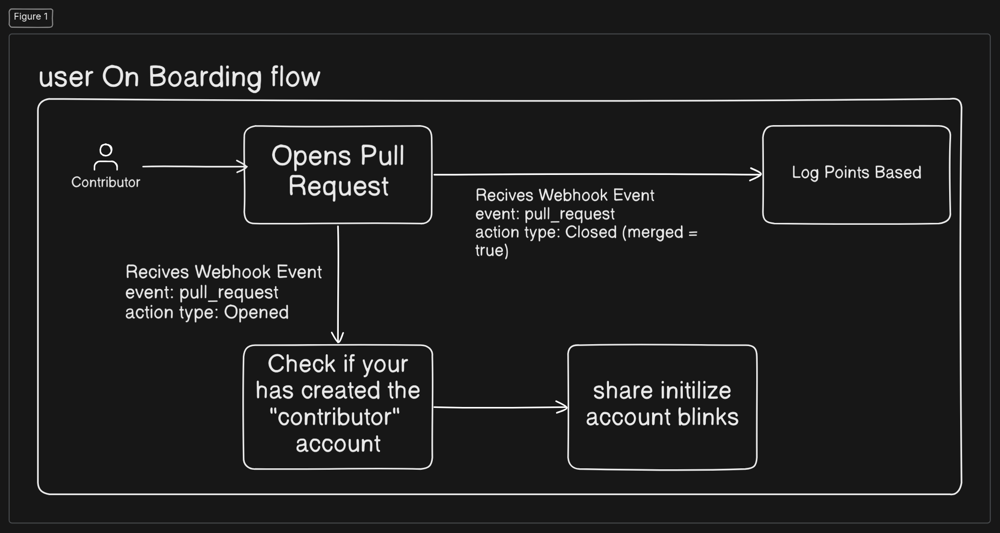

# Contribution Tracking System

## Overview

This system implements a decentralized point-tracking mechanism with automated token distribution based on user contributions. It features a fair distribution model with built-in ecosystem sustainability measures.

## Key Features

- **On-Chain Point Tracking**: Transparent and immutable tracking of contribution points
- **Monthly Reward Distribution**: Automated monthly token unlock pool for contributors
- **Ecosystem Protection**: Automatic 50% reallocation to ecosystem reserve when monthly points fall below 500 (i.e THRESHOLD)
- **Fair Distribution Algorithm**: Token distribution based on individual contribution relative to global points

```math
\text{Reward} = \frac{\text{Token Pool} \times \text{Individual Points}}{\text{Total Global Points}}
```

## System Architecture



## Getting Started

### Prerequisites

- Rust Programming Language
- Solana CLI Tools
- Anchor Framework (v0.30.1)
- Typescript and Yarn

### Installation

1. Clone the repository

```bash
 git clone https://github.com/Mahhheshh/contribution-tracking-anchor.git
````

2. Install dependencies

```bash
yarn install
```

3. Run tests
```bash
anchor test
```
